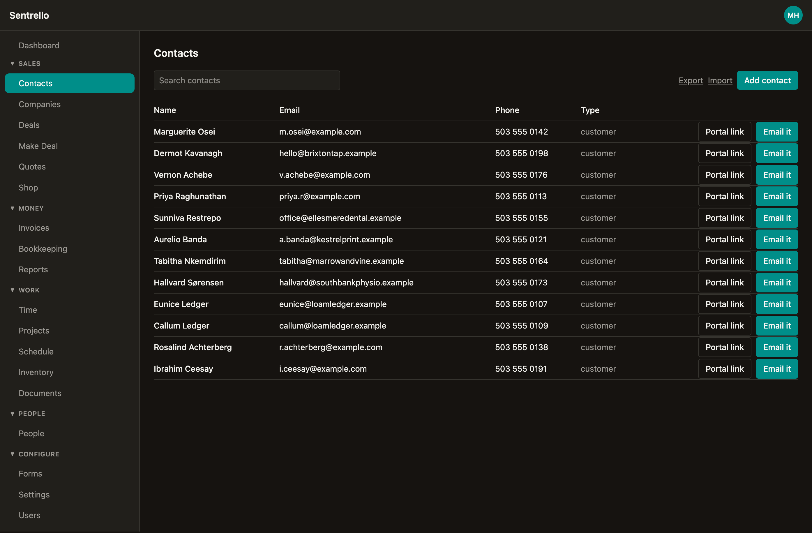
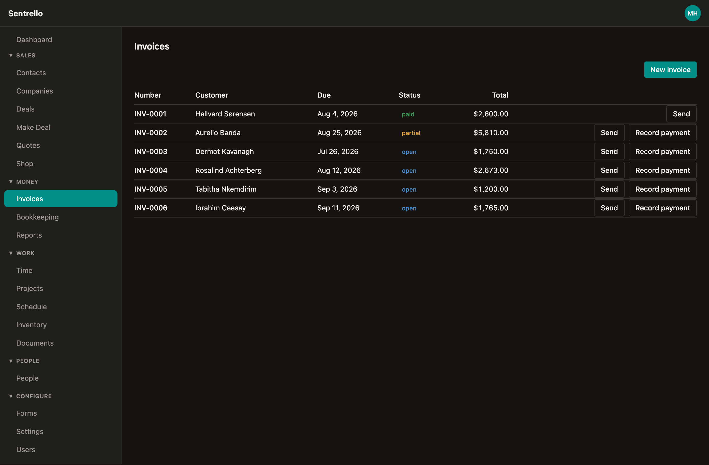
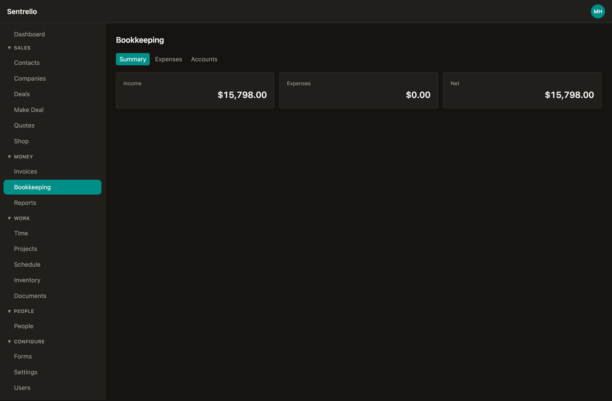
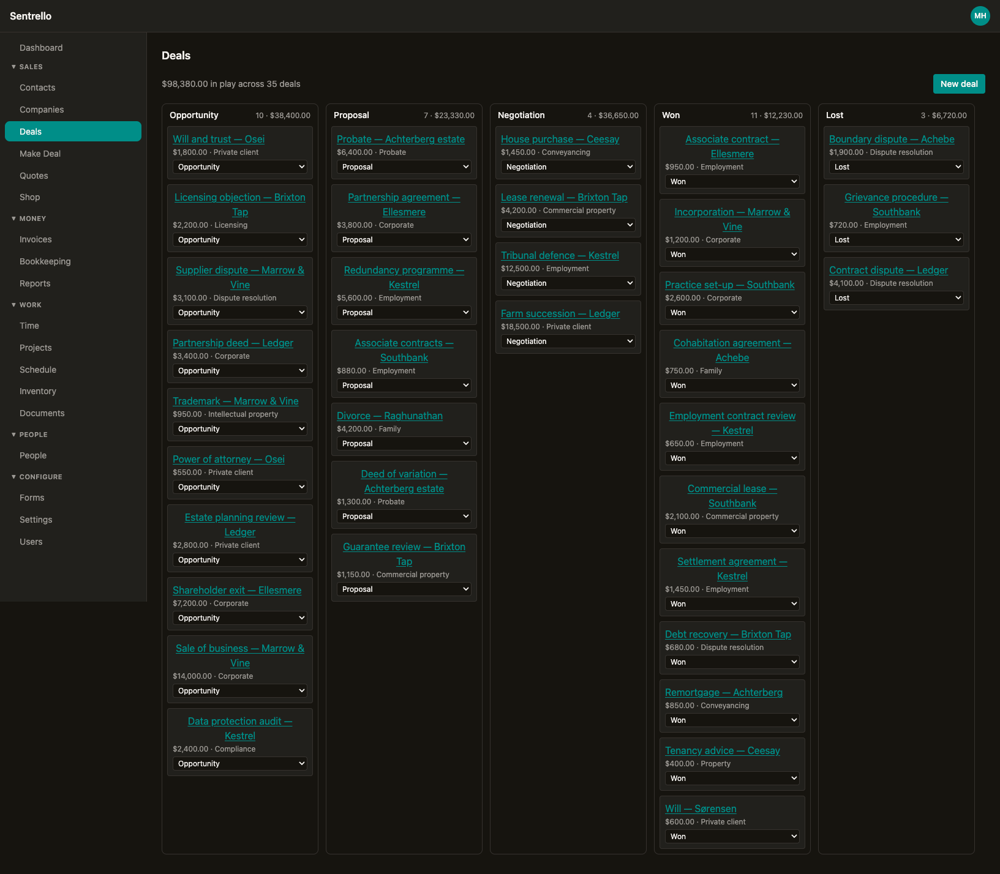
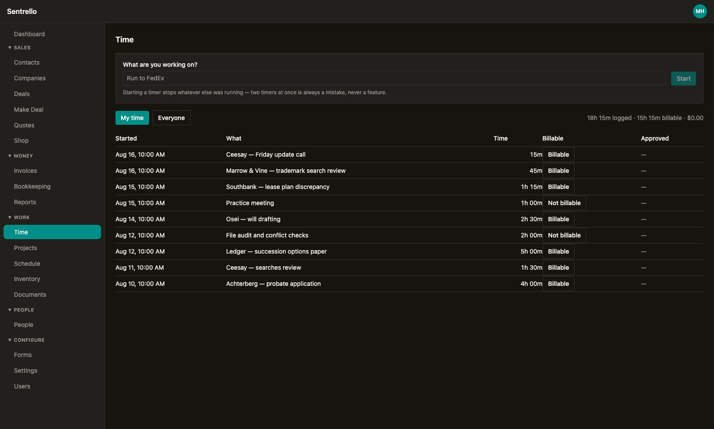

# Sentrello Core

**Run your whole business on software you actually own.** CRM, quotes and
invoicing, double-entry bookkeeping, and embeddable web forms — self-hosted on
your own server, with no per-user pricing and no copy of your data on anyone
else's infrastructure.

[](LICENSE)
[](https://bun.sh)
[](https://www.postgresql.org/)
[](#project-status)



---

## Install

On any Linux server with Docker or Podman:

```bash
curl -fsSL https://get.sentrello.com | bash
```

The installer asks for a domain and an administrator email, generates its own
database password and signing secrets, starts PostgreSQL and the app, and runs
migrations. A few minutes later you have a working instance. Put a reverse proxy
with TLS in front of it and you're done.

Prefer to look before you run a script? It's [right
here](https://get.sentrello.com/install.sh), and the image is
`ghcr.io/sentrello/core` (amd64 and arm64).

Manage it afterwards with `sentrello status | update | rollback | backup |
restore | logs`. Updates can also be applied from Settings, and every update
takes a database backup before it starts and refuses to continue without one.

**[Running it yourself](docs/self-hosting.md)** covers TLS, email, backups,
updates and what to look at when something is wrong — including exactly what an
instance does and does not send anywhere.

---

## What it looks like

Everything below is one install, running on one server, with one login.

**Invoicing** — raise an invoice and it posts to the ledger as you issue it.
Part payments are normal: the balance stays open and the books stay right.



**Bookkeeping** — real double-entry underneath, read back as plain numbers.
Every figure here is derived from journal entries, not from a spreadsheet
column someone can overwrite.



**Deals** — the pipeline as a board, with what each stage is worth. Free, and
part of the CRM.



### With Pro and the optional modules

**Time tracking** — timer-first, because the thing being timed is often a run
to the post office and a form that demands a project first is a form nobody
uses.



---

## Why this exists

Small businesses end up paying four subscriptions that don't talk to each other,
priced per user, holding data they can't reach. Adding a fifth employee means
five more charges. Sharing one login to avoid that is how most small businesses
end up with no audit trail at all.

Sentrello is one system, one price per instance, unlimited users, running on
hardware you control.

- **No per-seat pricing.** Give everyone their own account with the right
  permissions, because it costs nothing to do so.
- **Your data is yours.** The database is on your server. Query it, back it up,
  move it. If this project disappeared tomorrow, your instance keeps running.
- **Privacy by architecture.** Customer records, invoices and books never reach
  us. A paid instance sends one daily licence check — a key and an instance id,
  nothing else. A Free instance need never contact us at all.
- **Modular.** Buy the optional modules you need; skip the rest.

---

## What's included

**Free tier — this repository, AGPLv3:**

- **Dashboard** — what is owed, what is overdue, what needs answering, and how
  the server itself is doing
- **CRM** — contacts, companies, deals as a pipeline board, activities, tasks,
  notes, tags, and CSV import and export
- **Invoicing** — quotes and invoices with per-line tax, partial payments,
  sequential numbering, and quote-to-invoice conversion
- **Bookkeeping** — chart of accounts, expenses, and a real double-entry ledger
  with profit & loss
- **Forms** — contact and quote forms you can embed on any website, posting
  straight to your own instance
- **Accounts and roles** — Admin, Accounting, Staff and an external Customer
  role that only ever sees its own invoices, plus roles you define yourself
  when those four do not fit your business
- **Settings** — your business name, address and tax number, which appear on
  every invoice, quote and customer page you send; one-click updates and
  rollback; and an opt-in usage report you are asked about at install and can
  turn off at any time
- **Your account** — your own preferences, two-factor authentication, and the
  list of devices you are signed in on

**Pro and optional modules** are commercial and live in private repositories.
Pro adds a 360° customer timeline, recurring invoices, credit notes, online
payments, bank CSV import with reconciliation, AR aging, and the balance sheet,
cash flow and tax reports.

Optional modules are bought individually on top of Pro — scheduling, time
tracking, shop, projects, inventory, documents, people, and Make Deal, which
carries one job from quote to payment. A module needs Pro
underneath it; it is not sold against the Free tier.

The Free tier is a real product, not a trial. It doesn't expire, doesn't nag,
and doesn't need a licence key.

---

## How money is handled

Two rules the codebase does not bend on, because getting them wrong quietly
corrupts a business's books:

- **Money is integer cents.** Never floating point. Tax rates are basis points
  (`875` = 8.75%), applied per line.
- **Bookkeeping is double-entry.** Every financial event posts a balanced
  journal entry or throws. Reports are computed from the ledger, never from the
  invoice table.

---

## Architecture

A **modular monolith**: one deployable service that discovers feature modules at
startup. One container to run and one database to back up — the right trade for
a business with no operations team.

Every feature, free or paid, implements the same contract:

```ts
import { defineModule } from "@sentrello/module-sdk";

export default defineModule({
  id: "crm",
  tier: "free",
  register(ctx) {
    ctx.registerNav({ id: "crm", label: "Contacts", order: 10 });
    ctx.app.get("/api/contacts", requireSession(), requirePermission({ crm: ["read"] }), handler);
  },
});
```

Paid features are gated twice: the loader refuses to register a module the
licence doesn't cover, and each route checks permissions independently. Licences
are Ed25519-signed tokens verified **offline** against a public key embedded in
this repository — so an instance keeps working without reaching the internet,
and a missing or expired token degrades to Free rather than breaking.

| Layer | Choice |
|---|---|
| Runtime | Bun 1.3.14, TypeScript strict |
| API | Hono |
| Database | PostgreSQL 17 with Drizzle ORM |
| Auth | Better Auth — email/password, optional Google, org-scoped roles |
| Jobs | pg-boss, inside Postgres (no Redis) |
| Front end | React, Vite, TanStack Query, Tailwind |
| Deploy | Docker Compose, multi-arch |

---

## Development

```bash
bun install
cp .env.example .env
docker compose -f docker-compose.dev.yml up -d   # PostgreSQL
bun run db:migrate
bun run dev                                       # API + web
```

Then:

```bash
bun test          # every test runs against a real PostgreSQL, not mocks
bun run typecheck
bun run lint
```

Requires [Bun 1.3.14](https://bun.sh) exactly and a Docker runtime.

---

## Project status

**Early access.** The Free tier described above is built and tested, and the
install path works end to end. It has not yet been run by a large number of
businesses, so expect rough edges and please report them.

Not yet available, and not promised on any date: live bank feeds (bank data is
CSV import), QuickBooks or Xero sync, and mobile apps.

---

## Security

Found a vulnerability? **Please don't open a public issue.** Email
`security@sentrello.com` with what you found and how to reproduce it.

Things worth knowing if you're reviewing the code:

- Sign-up is closed by default. A fresh instance is claimed once by its owner
  using a setup token from the server's own `.env`; afterwards, people join by
  invitation.
- Every business query is scoped by organisation at the data layer.
- Public form endpoints enforce an origin allow-list, rate limiting and a
  honeypot, because they are internet-facing by design.

---

## Licence

[GNU AGPLv3](LICENSE). You may run, study, modify and share this software. If
you modify it and offer it to others over a network, you must publish your
changes under the same licence.

Pro features and optional modules are separately licensed commercial software
and are not covered by the AGPL.

Built by [Foothills Digital](https://sentrello.com).
